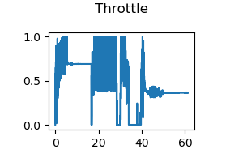
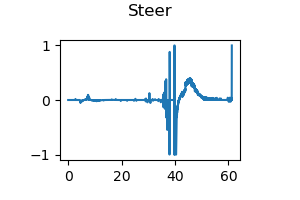

# Live Plotter Module

In this module, the functions relate to live plot are implemented.

For this project, we ploted dynamically the control figure and trajectory figure.

## Control Figure

The Control figure contains the changes of **Forward Speed**, **Throttle**, **Brake** and **Steer**.

In our case, because of the speed limitation as 30 km/h, the forward speed is mainly caused by throttle control. The brake value stays as 0.

## Trajectory Figure

The Trajectory figure visualizes the important static information in the simulation scene, including **waypoints of route, stop sign, and detected parked car**. 

The dynamic object, **ego vehicle as well as lead vehicle**, are also visualized here.

The **start point** and the **end point** is taged in the route.

Besides, the collision count and the trajectory waypoints with position, velocity and collision flag are saved in `.txt` files.