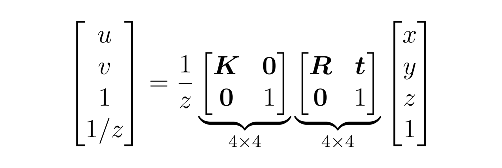
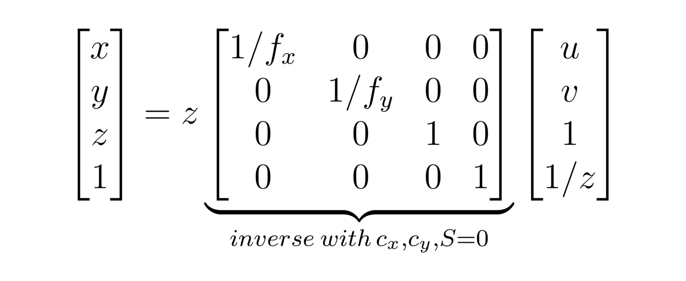

### Perception module

For locating object, we used carla depth image and segmented image. After having depth and segmented information, we used threshold of vehicle to find the pixel area of vehicle on segmented image and we employed regiong prob algorithm to find center point of each vehicle.  Afterwards we converted each center point of vehicle using inverse calibration matrix as follow.

The main problem related to this algorithm was finding focal lenght because we had just information of FOV angle ( Field of view). After that we used fov angle to compute focal lenght and our camera intristic matrix will be like below:
   **(Intrinsic) K Matrix**
    k = numpy.identity(3)
    k[0, 2] = image.width / 2.0
    k[1, 2] = image.height / 2.0
    k[0, 0] = k[1, 1] = image.width / (2.0 * math.tan(image.fov * math.pi / 360.0))

After that we applied inverse operation to intristic matrix and find our point cloud location. Using knowledge of our car and point cloud distance of object, we calculated the location of object on map. 
